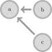
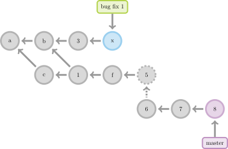
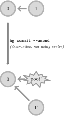
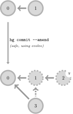

asciidag
========

This is a sphinx extension to test generating docs explaining DVCS concepts
(usually involving DAGs).

Here is a simple example

.. code-block:: rst
   
   .. dag:: Figure 1: an example dag

      a-b
       \
        c

Which will produce the following svg,

   Figure 1: an example dag

You can even add some simple styles with :code:`{node: a, text: foo}`

.. code-block:: rst

   .. dag::

      a-b
       \
        c

      {node: a, text: foo}

.. figure:: figures/simple-style-dag.svg

Currently, there are some predefined classes for style (e.g. 'bugnode',
'masternode', etc.). To add your own custom TikZ style, you'll need to provide
your own LaTeX preamble in ``conf.py``.

Let's see a complex example.

.. code-block:: rst

   .. dag::

            q
            |
      a-b-3-x
       \ \
        c-1-f-5
              :
              6-7-8
                  |
                  m
      {node: q, text: bug fix 1, class: nodenote}
      {node: x, class: bugnode}
      {node: 8, class: masternode}
      {node: m, text: master, class: masternote}

The main goal of this extension is to write documentation for Mercurial's
changeset evolution concept, so let's take an actual example from there

.. code-block:: rst

   .. dag:: Figure 1: unsafe history modification with core Mercurial (not
      using ``evolve``): the original revision 1 is destroyed.

      0-1

      || hg commit --amend
      || (destructive, not using evolve)

      0-p
       \
        1'
      {node: p, class: poof, text: poof!}

   Figure 1: unsafe history modification with core Mercurial (not using
   ``evolve``): the original revision 1 is destroyed.

.. code-block:: rst

   .. dag:: Figure 2: safe history modification using ``evolve``: the original
      revision 1 is preserved as an obsolete changeset. (The "temporary amend
      commit", marked with T, is an implementation detail stemming from
      limitations in Mercurial's current merge machinery. Future versions of
      Mercurial will not create them.)

      0-1

      || hg commit --amend
      || (safe, using evolve)

      0-1-2^T
       \:
        3

   Figure 2: safe history modification using ``evolve``: the original revision
   1 is preserved as an obsolete changeset. (The "temporary amend commit",
   marked with T, is an implementation detail stemming from limitations in
   Mercurial's current merge machinery. Future versions of Mercurial will not
   create them.)
